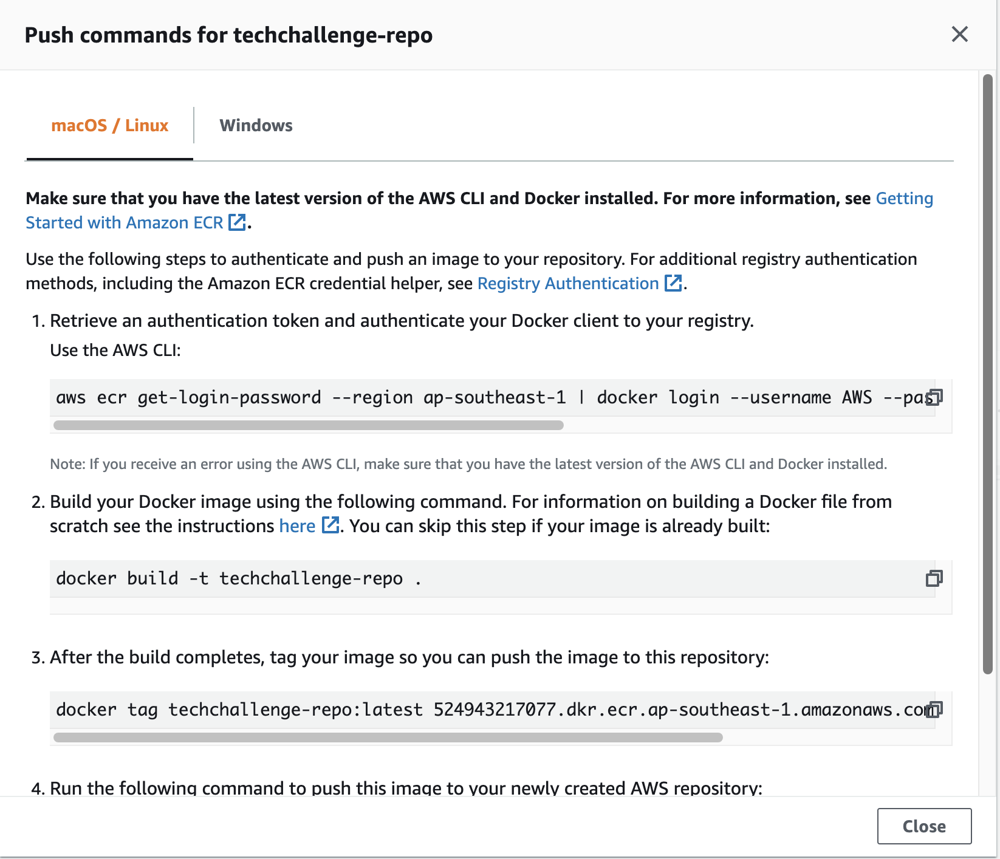

# Servian DevOps Tech Challenge - Tech Challenge App

[license]: https://github.com/DragonBlazer76/techchallenge

## Overview

This is the Servian DevOps Tech challenge assigned to me. 

## Prerequisites

Installation of the following is needed:
- [AWS cli](https://docs.aws.amazon.com/cli/latest/userguide/cli-chap-install.html)
- [Docker](https://docs.docker.com/get-docker/)
- [Terraform](https://learn.hashicorp.com/tutorials/terraform/install-cli)

## Steps that I did
1. Clone the repo from [Servian](https://github.com/servian/TechChallengeApp) Github
2. Change the `localhost` binding to `0.0.0.0` for `"ListenHost"` as docker cannot bind to localhost in `config.toml`
3. Build the docker image `docker build . -t techchallengeapp:latest`
4. Using Terraform, create a docker registry in AWS ECR
5. Push the image to ECR with the command with AWS command provided.

6. 
